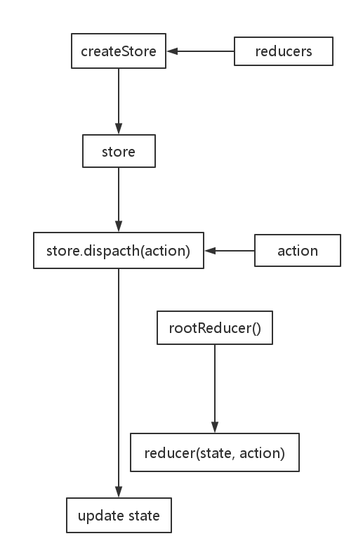
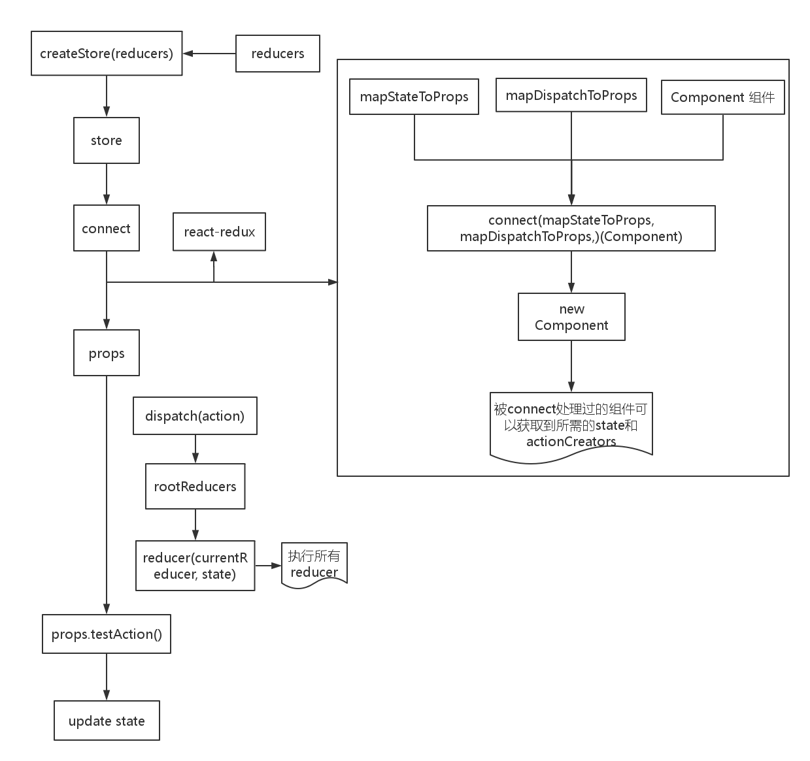

# redux

### redux三大原则

- 单一数据源
- state是只读的：改变state的方法？
- 使用纯函数修改state：reducers

### 核心概念

- action
- actionCreate
- reducers
- store


### redux执行流程

redux执行流程如下图所示：



### 示例代码

action.js

```
const TEST_ACTION = 'TEST_ACTION'
let testAction = (params) => {    // testAction -> actionCreate
  return {                     // action
    type: TEST_ACTION,
    params
  }
}
```

reducer.js

```
let initialState = {}
let testReducer = (state = initialState, action) => {
  switch(action.type) {
    case TEST_ACTION:
    	return Object.assign({}, state, action.params)
    default:
    	return state
  }
}
```

reducer中需要注意的几点：

- 不要修改state：可以通过Object.assign，object-assign库或Immutable.js保证不直接修改state
- 匹配不到任何action type时候必须返回初始state
- switch语法不是必须的
- 当一个reducer过长或处理的逻辑较多时候，可将其拆分开


拆分的reducer示例：

```
import { combinReducers } from 'redux'

let testA = (state = [], action) => {
  switch(action.type) {
    case TEST_ACTION:
    	return [...state, {
          name: action.params.name,
          age: action.params.age
    	}]
    default:
    	return state
  }
}

const CHANGE_NAME = 'CHANGE_NAME'
let testB = (state = 'abc', action) => {
  switch(ation.type) {
    case CHANGE_NAME:
    	return action.name
    default:
    	return state
  }
}

const rootReducer = combineReducers({
  testA,
  testB
})
```

combineReducers函数做了哪些事？

- 生成一个function
- 调用一系列reducer，每个reducer根据key从state中筛选一部分数据进行处理
- 将所有reducer处理的结果合并成一个大的对象

store.js

```
import { createStore } from 'redux'
import rootReducer from '../reducers'
import { testAction } from '../actions'

let store = createStore(rootReducer)

//测试流程
//打印初始state
console.log(store.getState)

//state更新时候会调用subscribe方法
let unsubscribe = store.subscribe(() => {
  console.log(store.getState())
})

//发起action
store.dispatch(testAction({
  name: 'abc',
  age: 21
}))

unsubscribe()
```


## redux搭配react

redux默认并不包含react的绑定库，需要单独安装react-redux。

```
npm install --save react-redux
```

两个地方需要改变：

- render的组件需要包裹到Provider（redux提供）组件中
- 使用connect方法将包裹好的组件连接到redux


### Provider

Provider是一个React组件，它的作用是保存store给子组件中的connect使用。

- 通过getChildContext方法把store保存到context里面
- connect中会通过context读取store

```
<Provider store={store}>
	<App />
</Provider>
```

### connect

connect会把state和dispatch转换成props传递给子组件。

```
import * as actionCreators from '../actions'
import { bindActionCreators } from 'redux'
import { connect } from 'react-redux'

function mapStateToProps(state) {
  return {
    list: state.list
  }
}

function mapDispatchToProps(dispatch) {
  return bindActionCreators(actionsCreators, dispatch)
}

export default connect(mapStateToProps, mapDispatchToProps)(Component)
```

### React + Redux的执行流程

